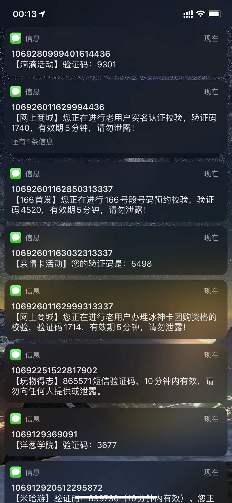

# sms_bomber
这个项目也就是有小伙伴需要，然后无聊随便写了一下就这么开源了。短信轰炸机源代码，希望大家可以更新新的API到api.txt中，可发起pr。


# Use Example

- 不多说，自己看源代码很简单。
- 觉得可以留一个star再走吧。
```bash
[Running] go run "/Users/ding/Desktop/sms-bomber/bom.go"
 ____                        __                      
/\  _`\                     /\ \                     
\ \ \L\ \    ___     ___ ___\ \ \____     __   _ __  
 \ \  _ <'  / __`\ /' __` __`\ \ '__`\  /'__`\/\`'__\
  \ \ \L\ \/\ \L\ \/\ \/\ \/\ \ \ \L\ \/\  __/\ \ \/ 
   \ \____/\ \____/\ \_\ \_\ \_\ \_,__/\ \____\\ \_\ 
    \/___/  \/___/  \/_/\/_/\/_/\/___/  \/____/ \/_/ 
                                                     
[INFO] 开始: 199xxxxxxx bom bom...
[INFO] 2020-12-07 00:44:37 第 1 轮执行完成.
[INFO] 2020-12-07 00:45:07 第 2 轮执行完成.

[Done] exited with code=null in 48.045 seconds
```

**对了，最近这个项目使用的人多了，部分api接口好像有了限制不能正常调用，看自己运气。Goodluck😬，还有部分代码最好不要修改，因为我埋坑了。**


